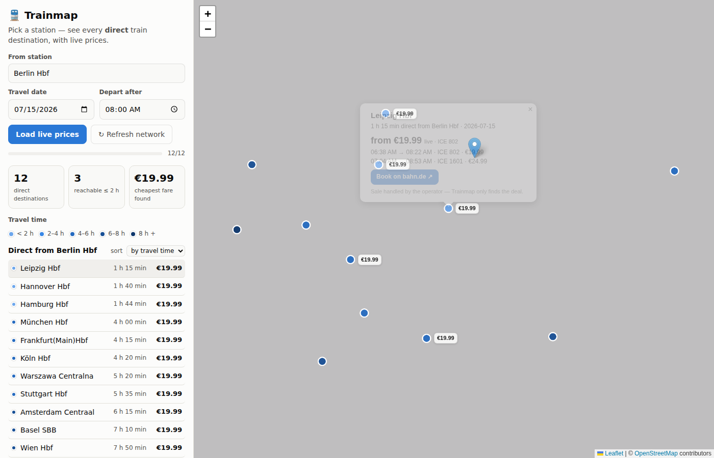

# 🚆 Trainmap

**Google Flights, but for trains.** Pick a departure station on the map and instantly see
every destination you can reach **without changing trains** — color-coded by travel time,
with **live prices** fetched on demand. Booking is handed off to the operator; Trainmap is
the aggregator that finds the deal.



## Try it

It is a plain static site — no build step, no server, no keys:

```bash
git clone <this repo> && cd trains
npx serve .          # or: python3 -m http.server 8080
# open http://localhost:8080
```

Or enable GitHub Pages (Settings → Pages → Source: *GitHub Actions*) and the included
workflow deploys it on every push to `main` — free hosting.

## Where the data comes from (nothing is hardcoded)

| Data | Source | Freshness |
|---|---|---|
| Station search | [`v6.db.transport.rest`](https://v6.db.transport.rest) — free community REST API over Deutsche Bahn's live HAFAS endpoint | live |
| Direct-route network per station | [`api.direkt.bahn.guru`](https://direkt.bahn.guru) — index of no-change connections derived from live timetable data | fetched live, cached locally for 24 h ("we own the topology") |
| Prices & departure times | `v6.db.transport.rest /journeys` (`transfers=0`) — real bahn.de fares | always live (15-min session cache only) |
| Automatic fallback (when the bahn stack is down) | [`api.transitous.org`](https://transitous.org) — worldwide community MOTIS instance: station search + direct destinations from live departures; no fares | live |
| Map tiles | OpenStreetMap | live |

Both APIs are keyless, CORS-enabled and free. All requests go **directly from the
visitor's browser** to those APIs, so the whole product runs with zero server cost.
The footer of the app shows the live health of each source and when the route network
was last synced.

Coverage today: all of Germany plus most European long-distance stations that appear in
DB's timetable (Wien, Zürich, Paris, Amsterdam, Praha, Warszawa, …). See
[docs/ARCHITECTURE.md](docs/ARCHITECTURE.md) for how this scales to more sources and
eventually worldwide.

## Features in the prototype

- **Flexibility-first search**: you only choose *where you start* — the map answers
  "where can I go, how long does it take, what does it cost".
- Station autocomplete → all direct destinations plotted, color-binned by travel time
  (validated colorblind-safe single-hue ramp) with a legend and stat tiles.
- **Load live prices**: batch-fetches real fares for a chosen date (rate-limited,
  cancellable, progress bar); the five cheapest deals get price labels on the map.
- Click any destination: live fare, next direct departures with train numbers, and a
  **Book on bahn.de** hand-off link — the operator owns the sale (that's the future
  commission channel).
- Route network cached in `localStorage` with 24 h TTL + manual "Refresh network";
  prices are never persisted beyond a 15-minute session cache.
- Shareable URLs (`#s=<stationId>`), dark mode, responsive layout.

## Tests

`npm install && npm test` runs an offline Playwright smoke test of the full UI flow
(search → destinations → batch prices → popup → booking link → cache behaviour). It
intercepts the API hosts and serves recorded responses in the documented shapes, so it
works in CI without network. **The app itself never uses these fixtures** — in the
browser all data is live.

## Repository layout

```
index.html            app shell
css/style.css         theming (light/dark), layout
js/api.js             data layer: sources, caching, rate limiting, booking hand-off
js/app.js             map, autocomplete, price queue, UI state
vendor/leaflet/       vendored Leaflet 1.9.4 (BSD-2) — no CDN dependency
tests/                offline smoke test + recorded API fixtures
docs/ARCHITECTURE.md  product & scaling notes
```
